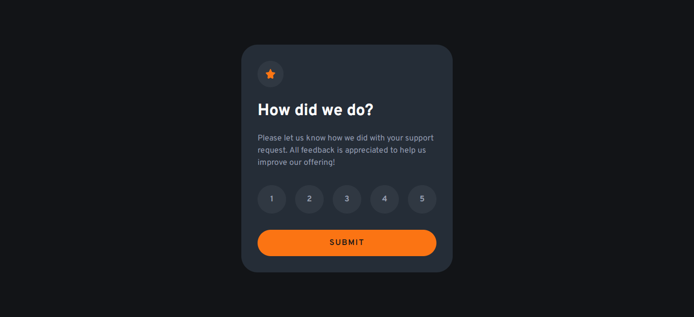
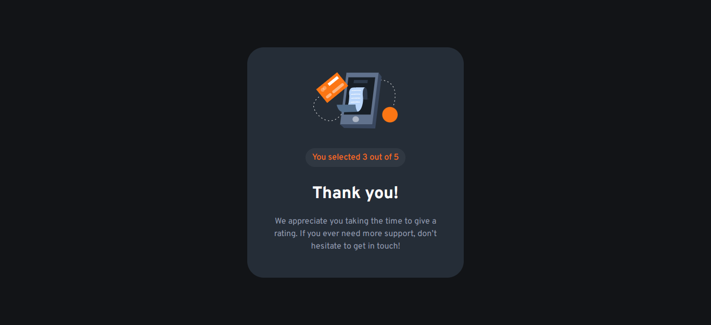
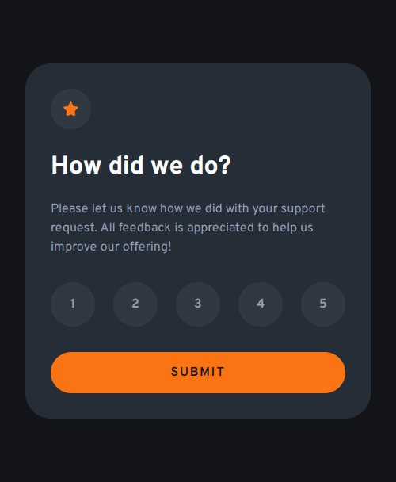
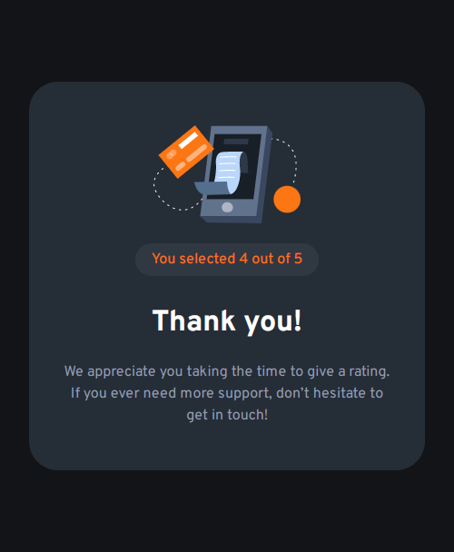

# Frontend Mentor - Interactive rating component solution

This is a solution to the [Interactive rating component challenge on Frontend Mentor](https://www.frontendmentor.io/challenges/interactive-rating-component-koxpeBUmI).

## Table of contents

- [Overview](#overview)
  - [Screenshot](#screenshot)
  - [Links](#links)
- [My process](#my-process)
  - [Built with](#built-with)
  - [What I learned](#what-i-learned)
  - [Useful resources](#useful-resources)
- [Author](#author)

## Overview

### The challenge

Users should be able to:

- View the optimal layout for the app depending on their device's screen size
- See hover states for all interactive elements on the page
- Select and submit a number rating
- See the "Thank you" card state after submitting a rating

### Screenshot






### Links

- Solution URL: [Github repo](https://github.com/b16h22/interactive_rating_component_solution)
- Live Site URL: [Github pages](https://b16h22.github.io/interactive_rating_component_solution/)

## My process

### Built with

- Semantic HTML5 markup
- CSS custom properties
- Flexbox
- Javascript

### What I learned

Set onclick event listener to a button and execute a function which gets the rating submitted and updates a <p> tag.

```js
    const layoutOne = document.getElementById("l1");
    const layoutTwo = document.getElementById("l2");
    const submitButton = document.getElementById("submit-button");
    let rating = 0;

    submitButton.onclick = submitRating;

    function submitRating() {
      layoutOne.style.display = "none";
      layoutTwo.style.display = "block";
      document.getElementById("summary").innerHTML = "You selected " + rating + " out of 5";
    };
```
### Useful resources

- [HTML DOM Elements](https://www.w3schools.com/js/js_htmldom_elements.asp) - This helped me learn about HTML DOM elements and methods to access them.
- [JS events](https://www.w3schools.com/js/js_events.asp) - This helped me understand JS events and event listeners.

## Author

- Frontend Mentor - [@b16h22](https://www.frontendmentor.io/profile/b16h22)
